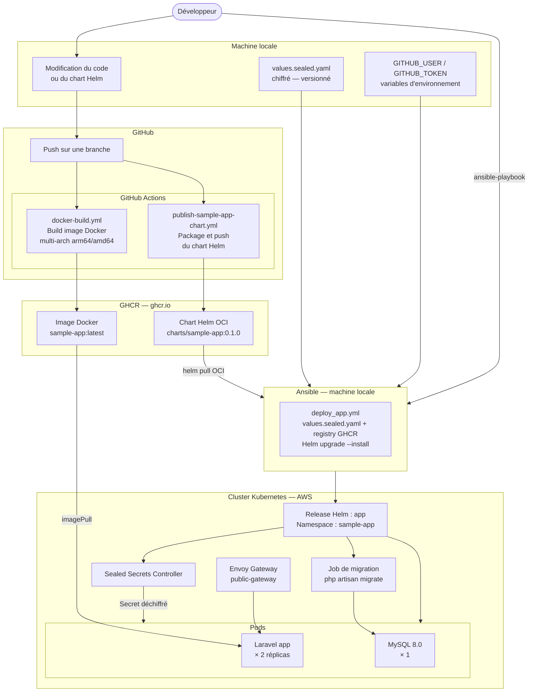
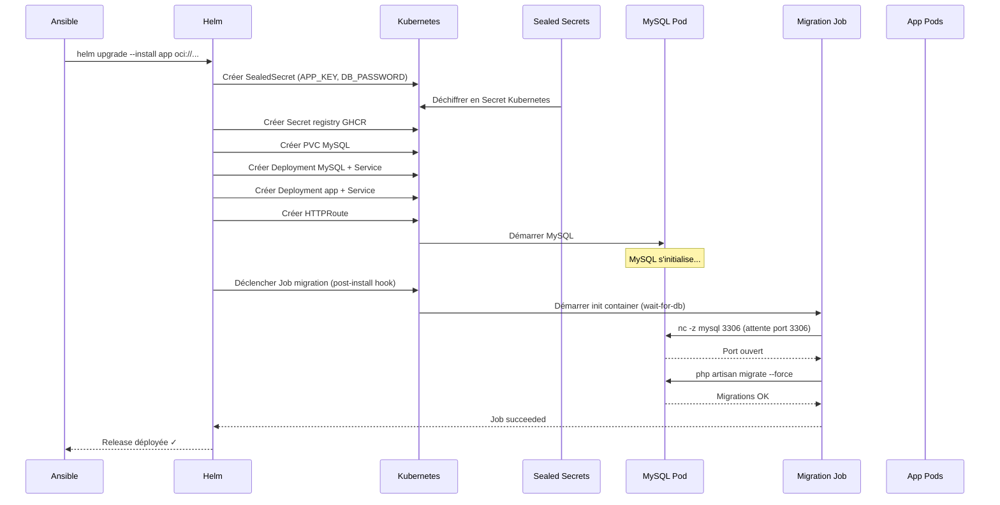

# Flux de déploiement

## CI/CD — Publication du chart et de l'image

```mermaid
flowchart TD
    dev([Développeur])

    subgraph local[Machine locale]
        code[Modification du code\nou du chart Helm]
        sealed[values.sealed.yaml\nchiffré — versionné]
        ghcr_env[GITHUB_USER / GITHUB_TOKEN\nvariables d'environnement]
    end

    subgraph github[GitHub]
        push[Push sur une branche]
        subgraph ci[GitHub Actions]
            ci_docker[docker-build.yml\nBuild image Docker\nmulti-arch arm64/amd64]
            ci_helm[publish-sample-app-chart.yml\nPackage et push\ndu chart Helm]
        end
    end

    subgraph ghcr[GHCR — ghcr.io]
        img[Image Docker\nsample-app:latest]
        chart[Chart Helm OCI\ncharts/sample-app:0.1.0]
    end

    subgraph ansible[Ansible — machine locale]
        playbook[deploy_app.yml\nvalues.sealed.yaml + registry GHCR\nHelm upgrade --install]
    end

    subgraph cluster[Cluster Kubernetes — AWS]
        helm_release[Release Helm : app\nNamespace : sample-app]
        sealed_ctrl[Sealed Secrets Controller]
        subgraph pods[Pods]
            app_pod[Laravel app\n× 2 réplicas]
            mysql_pod[MySQL 8.0\n× 1]
        end
        migration[Job de migration\nphp artisan migrate]
        gateway[Envoy Gateway\npublic-gateway]
    end

    dev --> code
    code --> push
    push --> ci_docker --> img
    push --> ci_helm --> chart

    dev --> |ansible-playbook| ansible
    sealed --> ansible
    ghcr_env --> ansible
    chart --> |helm pull OCI| ansible
    ansible --> helm_release
    helm_release --> sealed_ctrl
    sealed_ctrl --> |Secret déchiffré| pods
    img --> |imagePull| app_pod
    helm_release --> pods
    helm_release --> migration
    migration --> mysql_pod
    gateway --> app_pod
```

## Ordre des opérations lors d'un `helm upgrade --install`

```mermaid
sequenceDiagram
    participant A as Ansible
    participant H as Helm
    participant K as Kubernetes
    participant S as Sealed Secrets
    participant M as MySQL Pod
    participant J as Migration Job
    participant P as App Pods

    A->>H: helm upgrade --install app oci://...
    H->>K: Créer SealedSecret (APP_KEY, DB_PASSWORD)
    S->>K: Déchiffrer en Secret Kubernetes
    H->>K: Créer Secret registry GHCR
    H->>K: Créer PVC MySQL
    H->>K: Créer Deployment MySQL + Service
    H->>K: Créer Deployment app + Service
    H->>K: Créer HTTPRoute
    K->>M: Démarrer MySQL
    Note over M: MySQL s'initialise...
    H->>K: Déclencher Job migration (post-install hook)
    K->>J: Démarrer init container (wait-for-db)
    J->>M: nc -z mysql 3306 (attente port 3306)
    M-->>J: Port ouvert
    J->>M: php artisan migrate --force
    M-->>J: Migrations OK
    J-->>H: Job succeeded
    H-->>A: Release déployée ✓
```
